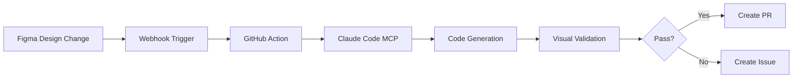

# CI/CD Entegrasyonu

Bu rehber, Figma-to-code skill'inin CI/CD pipeline'ına entegrasyonunu açıklar.

## GitHub Actions Workflow

**Dosya:** `.github/workflows/figma-visual-test.yml`

```yaml
name: Figma Visual Regression

on:
  pull_request:
    paths:
      - 'src/components/**'
  workflow_dispatch:
    inputs:
      figma_url:
        description: 'Figma URL to validate'
        required: true
        type: string

env:
  FIGMA_ACCESS_TOKEN: ${{ secrets.FIGMA_ACCESS_TOKEN }}

jobs:
  visual-test:
    runs-on: ubuntu-latest
    
    steps:
      - name: Checkout
        uses: actions/checkout@v4

      - name: Setup Node.js
        uses: actions/setup-node@v4
        with:
          node-version: '20'
          cache: 'npm'

      - name: Install dependencies
        run: npm ci

      - name: Install Playwright browsers
        run: npx playwright install chromium

      - name: Start dev server
        run: |
          npm run dev &
          npx wait-on http://localhost:3000

      - name: Run visual validation
        run: |
          node .claude/skills/figma-to-code/scripts/validate-visual.js \
            --component=${{ github.event.inputs.component || 'all' }} \
            --reference=.claude/tmp/reference.png
        continue-on-error: true

      - name: Upload diff artifacts
        if: always()
        uses: actions/upload-artifact@v4
        with:
          name: visual-diff-${{ github.run_number }}
          path: |
            .claude/tmp/diff.png
            .claude/tmp/rendered.png
          retention-days: 7

      - name: Comment PR with results
        if: github.event_name == 'pull_request'
        uses: actions/github-script@v7
        with:
          script: |
            const fs = require('fs');
            const resultPath = '.claude/tmp/validation-result.json';
            
            if (fs.existsSync(resultPath)) {
              const result = JSON.parse(fs.readFileSync(resultPath, 'utf8'));
              
              const emoji = result.success ? '✅' : result.acceptable ? '⚠️' : '❌';
              const status = result.success ? 'Passed' : result.acceptable ? 'Acceptable' : 'Failed';
              
              const body = `## ${emoji} Visual Regression ${status}
              
              | Metric | Value |
              |--------|-------|
              | Pixel Difference | ${result.diffPercent}% |
              | Threshold | <2% (pass), <5% (acceptable) |
              
              ${result.suggestions?.length ? '### Suggestions\n' + result.suggestions.map(s => `- ${s}`).join('\n') : ''}
              
              [View diff artifact](../actions/runs/${process.env.GITHUB_RUN_ID})`;
              
              github.rest.issues.createComment({
                issue_number: context.issue.number,
                owner: context.repo.owner,
                repo: context.repo.repo,
                body
              });
            }

  storybook-visual:
    runs-on: ubuntu-latest
    needs: visual-test
    
    steps:
      - name: Checkout
        uses: actions/checkout@v4

      - name: Setup Node.js
        uses: actions/setup-node@v4
        with:
          node-version: '20'
          cache: 'npm'

      - name: Install dependencies
        run: npm ci

      - name: Build Storybook
        run: npm run build-storybook

      - name: Run Chromatic
        uses: chromaui/action@latest
        with:
          projectToken: ${{ secrets.CHROMATIC_PROJECT_TOKEN }}
          exitZeroOnChanges: true
```

## Secrets Kurulumu

GitHub repository settings'de şu secrets'ları ekleyin:

| Secret | Açıklama | Nereden Alınır |
|--------|----------|----------------|
| `FIGMA_ACCESS_TOKEN` | Figma API erişimi | Figma Settings → Personal Access Tokens |
| `CHROMATIC_PROJECT_TOKEN` | Chromatic entegrasyonu | chromatic.com → Project Settings |

## Webhook Entegrasyonu (Gelecek Özellik)

Figma'da tasarım değiştiğinde otomatik PR açan webhook sistemi:



### Webhook Endpoint Örneği

**Dosya:** `api/figma-webhook.ts` (Next.js API Route)

```typescript
import { NextRequest, NextResponse } from 'next/server';
import crypto from 'crypto';

const FIGMA_WEBHOOK_SECRET = process.env.FIGMA_WEBHOOK_SECRET!;

export async function POST(request: NextRequest) {
  // 1. Webhook imzasını doğrula
  const signature = request.headers.get('x-figma-signature');
  const body = await request.text();
  
  const expectedSignature = crypto
    .createHmac('sha256', FIGMA_WEBHOOK_SECRET)
    .update(body)
    .digest('hex');
  
  if (signature !== expectedSignature) {
    return NextResponse.json({ error: 'Invalid signature' }, { status: 401 });
  }

  // 2. Event'i parse et
  const event = JSON.parse(body);
  
  if (event.event_type === 'FILE_UPDATE') {
    const { file_key, file_name, modified_components } = event;
    
    // 3. GitHub Action tetikle
    await fetch(
      `https://api.github.com/repos/${process.env.GITHUB_REPO}/dispatches`,
      {
        method: 'POST',
        headers: {
          'Authorization': `token ${process.env.GITHUB_TOKEN}`,
          'Accept': 'application/vnd.github.v3+json',
        },
        body: JSON.stringify({
          event_type: 'figma-update',
          client_payload: {
            file_key,
            file_name,
            modified_components,
          },
        }),
      }
    );
    
    return NextResponse.json({ status: 'triggered' });
  }
  
  return NextResponse.json({ status: 'ignored' });
}
```

### Figma Webhook Kurulumu

1. Figma Admin Console → Webhooks
2. Endpoint URL: `https://your-domain.com/api/figma-webhook`
3. Events: `FILE_UPDATE`, `LIBRARY_PUBLISH`
4. Secret key oluştur ve `FIGMA_WEBHOOK_SECRET` olarak kaydet

## PR Template

**Dosya:** `.github/PULL_REQUEST_TEMPLATE/figma-component.md`

```markdown
## 🎨 Figma Component Update

### Source
- **Figma URL:** [Link]()
- **Component:** ComponentName

### Checklist
- [ ] Visual regression passed (<2% diff)
- [ ] Responsive breakpoints tested (320px, 768px, 1024px)
- [ ] Accessibility audit passed
- [ ] Storybook story added
- [ ] Unit tests added

### Screenshots

| Figma | Code |
|-------|------|
|  |  |

### Changes
- 

### Manual Review Required
- [ ] Token mapping verified
- [ ] Existing component reuse checked
```

## Monitoring & Alerts

### Slack Notification

```yaml
# .github/workflows/figma-visual-test.yml içine ekle

      - name: Notify Slack on failure
        if: failure()
        uses: slackapi/slack-github-action@v1
        with:
          payload: |
            {
              "text": "❌ Visual regression failed for ${{ github.event.pull_request.title }}",
              "blocks": [
                {
                  "type": "section",
                  "text": {
                    "type": "mrkdwn",
                    "text": "*Visual Regression Failed*\nPR: <${{ github.event.pull_request.html_url }}|${{ github.event.pull_request.title }}>\nDiff: ${{ env.DIFF_PERCENT }}%"
                  }
                }
              ]
            }
        env:
          SLACK_WEBHOOK_URL: ${{ secrets.SLACK_WEBHOOK_URL }}
```

## Best Practices

1. **Her component için baseline sakla** — `baselines/ComponentName.png`
2. **PR'da görsel diff zorunlu** — Branch protection rule ekle
3. **Chromatic ile Storybook test** — Her PR'da otomatik
4. **Haftalık full regression** — Scheduled workflow
5. **Design system sync** — Figma library publish'de otomatik güncelleme
